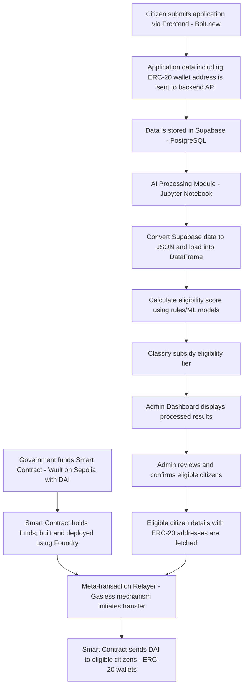

# PADU Citizen Subsidy Platform | PADU 公民补贴平台

## Overview / 项目概述
This project is designed to streamline the subsidy application process by automating eligibility checks with AI and distributing funds via a blockchain smart contract on Sepolia. The system is built with a modern frontend (using Bolt.new), Supabase as the backend database, and smart contracts to handle DAI transfers in a gasless fashion.

## 系统架构 | System Architecture

## 技术栈 | Technology Stack

### 前端 (Frontend)
- React with TypeScript
- Tailwind CSS
- Vite

### 后端 (Backend)
- Supabase (Serverless Database)
- PostgreSQL
- Jupyter Notebook (AI Processing)
- Foundry (Smart Contract Development)

### AI/ML 组件 | AI/ML Components
- Eligibility Scoring
- Subsidy Tier Classification
- Machine Learning Models

### 区块链 | Blockchain
- ERC-20 Token Integration
- Smart Contract Development
- Gasless Meta-transactions
  
# AI-Driven Subsidy Eligibility System with Gasless ERC-20 Transfers
# 基于 AI 的补贴资格判定系统与免燃气 ERC-20 转账

本项目旨在通过 AI 自动化补贴资格判定流程，并利用部署在 Sepolia 的智能合约实现免燃气费的 DAI 转账，简化政府补贴发放流程。系统采用 Bolt.new 构建前端，Supabase 作为后端数据库，同时结合智能合约实现资金分发。

## Architecture / 架构概述

1. **Frontend & Data Submission / 前端与数据提交**
   - **Citizen Application Form:** Citizens submit their personal details including MyKad, contact info, and their ERC-20 wallet address.
   - **公民申请表：** 公民通过表单提交个人信息，包括身份证号码、联系方式和 ERC-20 钱包地址。

2. **Backend & Database / 后端与数据库**
   - **Supabase (PostgreSQL):** All submissions are stored in a Supabase database for further processing.
   - **Supabase (PostgreSQL)：** 所有申请数据存储在 Supabase 数据库中，以便后续处理。

3. **AI Eligibility Processing / AI 资格处理**
   - **Data Extraction & Analysis:** Citizen data is extracted from Supabase (converted to JSON) and processed using a Jupyter Notebook module.
   - **Eligibility Scoring:** Based on factors like monthly income, employment status, and government assistance, a score is calculated. This score is used to classify applicants into High, Medium, or Low subsidy priority.
   - **数据提取与分析：** 从 Supabase 提取数据（转为 JSON 格式），并使用 Jupyter Notebook 模块进行处理。
   - **资格评分：** 根据月收入、就业状态、政府援助等因素计算评分，并将申请者分为高、中、低优先级。

4. **Admin Review / 管理审核**
   - **Dashboard:** An admin dashboard displays the eligibility results, allowing officials to review and confirm eligible citizens.
   - **仪表板：** 管理人员可以通过仪表板查看申请处理结果，审核并确认符合条件的公民。

5. **Blockchain Fund Distribution / 区块链资金分发**
   - **Smart Contract Vault:** The government funds a smart contract vault (deployed on Sepolia) with DAI.
   - **Smart Contract Interaction:** Using Foundry, the smart contract is built to send DAI funds to eligible citizens’ ERC-20 wallet addresses.
   - **Gasless Transactions:** A meta-transaction relayer is integrated to sponsor the gas fees, ensuring citizens who do not hold native ETH can still receive funds.
   - **智能合约资金库：** 政府向部署在 Sepolia 上的智能合约资金库注入 DAI 资金。
   - **智能合约交互：** 使用 Foundry 构建智能合约，将 DAI 资金转账至符合条件的公民 ERC-20 钱包。
   - **免燃气费交易：** 集成元交易中继器，为没有原生 ETH 的公民承担燃气费，实现免燃气费转账。

## Detailed Process Flow / 详细流程
1. **Application Submission / 申请提交:**
   - Citizens use the Bolt.new frontend to submit their data.
   - 公民通过 Bolt.new 前端提交申请数据。

2. **Data Storage / 数据存储:**
   - Data is stored in Supabase.
   - 数据存储在 Supabase 数据库中。

3. **Eligibility Analysis / 资格分析:**
   - The AI module (Jupyter Notebook) retrieves data, computes eligibility scores, and classifies subsidy tiers.
   - AI 模块（Jupyter Notebook）提取数据，计算资格分数，并对补贴优先级进行分类。

4. **Admin Confirmation / 管理确认:**
   - An admin dashboard displays the results for review.
   - 管理仪表板显示处理结果供审核。

5. **Funding and Distribution / 资金注入与分发:**
   - Government funds the smart contract vault on Sepolia with DAI.
   - 政府通过 DAI 向 Sepolia 上的智能合约资金库注资。
   - Eligible citizens’ ERC-20 wallet addresses are fetched and the smart contract initiates DAI transfers.
   - 获取符合条件的公民 ERC-20 钱包地址后，智能合约发起 DAI 转账。
   - A meta-transaction relayer handles gas fees for a seamless, gasless user experience.
   - 元交易中继器承担燃气费，确保用户免燃气费体验。

## Usage / 使用方法
1. **Frontend Setup:**  
   - Use Bolt.new to create the user interface for data collection.
   - 使用 Bolt.new 创建数据收集前端界面。

2. **Backend Setup:**  
   - Configure Supabase with the provided schema.
   - 配置 Supabase 数据库并创建相应数据结构。

3. **AI Module:**  
   - Run the Jupyter Notebook to process and analyze the data.
   - 运行 Jupyter Notebook 模块处理和分析数据。

4. **Smart Contract Deployment:**  
   - Deploy the smart contract on the Sepolia testnet using Foundry.
   - 使用 Foundry 将智能合约部署到 Sepolia 测试网。

5. **Gasless Transaction Configuration:**  
   - Integrate a meta-transaction relayer to manage gas fees during transfers.
   - 集成元交易中继器，在转账过程中管理燃气费用。

## Future Enhancements / 未来扩展
- **Additional AI Models:** Incorporate machine learning to improve fraud detection and subsidy prediction.
- **扩展 AI 模型：** 引入更多机器学习模型以提高欺诈检测和补贴预测准确性。
- **Dashboard Analytics:** Build advanced analytics for real-time subsidy tracking.
- **仪表板分析：** 构建高级分析功能，实现实时补贴追踪。
- **Blockchain Upgrades:** Consider multi-chain support and more robust gasless mechanisms.
- **区块链升级：** 考虑支持多链以及更完善的免燃气费解决方案。

## 联系方式 | Contact

- 项目负责人 | Project Maintainer: harszehao
- 电子邮件 | Email: [szehaohar@1utar.my]
