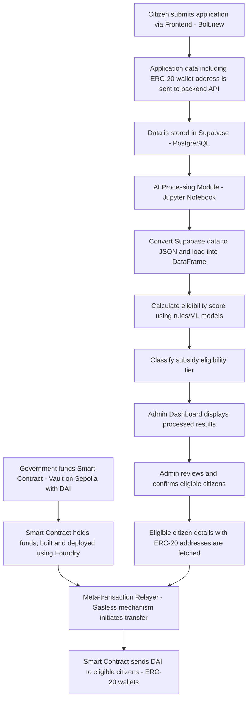

# PADU Citizen Subsidy Platform | PADU 公民补贴平台

## 项目流程 | Project Flow

### 中文 (Chinese)
PADU 是一个创新的公民补贴管理平台，通过先进的技术解决方案简化公民资格评估和补贴分配过程。

### English
PADU is an innovative citizen subsidy management platform that streamlines citizen eligibility assessment and subsidy allocation through advanced technological solutions.

## 系统架构 | System Architecture



## 技术栈 | Technology Stack

### 前端 (Frontend)
- React with TypeScript
- Tailwind CSS
- Vite

### 后端 (Backend)
- Supabase (Serverless Database)
- PostgreSQL
- Jupyter Notebook (AI Processing)
- Foundry (Smart Contract Development)

### AI/ML 组件 | AI/ML Components
- Eligibility Scoring
- Subsidy Tier Classification
- Machine Learning Models

### 区块链 | Blockchain
- ERC-20 Token Integration
- Smart Contract Development
- Gasless Meta-transactions

## 关键功能 | Key Features

1. 公民注册与资格评估 | Citizen Registration and Eligibility Assessment
   - 收集和验证公民信息
   - 使用机器学习模型计算补贴资格
   - Collect and validate citizen information
   - Calculate subsidy eligibility using ML models

2. 管理员仪表板 | Admin Dashboard
   - 审查和确认符合条件的公民
   - 可视化补贴分配数据
   - Review and confirm eligible citizens
   - Visualize subsidy allocation data

3. 无gas元交易 | Gasless Meta-transactions
   - 简化区块链交互
   - 降低用户参与成本
   - Simplify blockchain interactions
   - Reduce user participation costs

## 安装与设置 | Installation and Setup

### 先决条件 | Prerequisites
- Node.js (v18+)
- Supabase 账户
- Jupyter Notebook
- Foundry

### 安装步骤 | Installation Steps

1. 克隆仓库 | Clone Repository
```bash
git clone https://github.com/your-username/padu-platform.git
cd padu-platform
```

2. 安装依赖 | Install Dependencies
```bash
npm install
# 或 | or
yarn install
```

3. 配置环境变量 | Configure Environment
- 设置 Supabase 凭证
- 配置区块链钱包
- Set up Supabase credentials
- Configure blockchain wallet

## 开发路径 | Development Roadmap

1. 前端开发 | Frontend Development
2. 后端 API 集成 | Backend API Integration
3. AI 模型开发 | AI Model Development
4. 智能合约实现 | Smart Contract Implementation
5. 测试与部署 | Testing and Deployment

## 安全性考虑 | Security Considerations

- 数据加密
- 行级安全策略
- 区块链交易安全
- Data encryption
- Row-level security policies
- Blockchain transaction security

## 贡献 | Contributing

1. Fork 仓库
2. 创建功能分支
3. 提交更改
4. 推送分支
5. 提交 Pull Request

## 许可证 | License

[MIT License]

## 联系方式 | Contact

- 项目负责人 | Project Maintainer: harszehao
- 电子邮件 | Email: [szehaohar@1utar.my]
